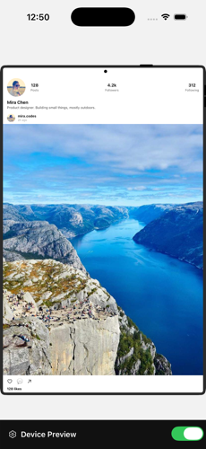
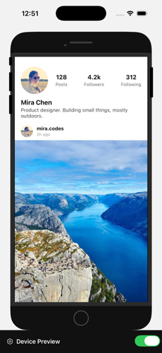
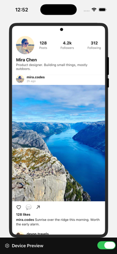
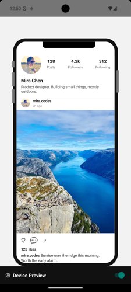
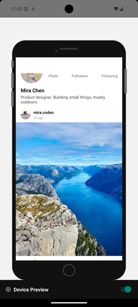
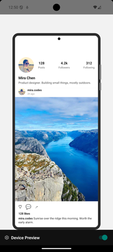

# rn-device-preview

Approximate how your React Native app looks and behaves on other devices — right inside your own app, live, with no simulator/emulator required. Inspired by Flutter's [`device_preview_plus`](https://pub.dev/packages/device_preview_plus).

Wrap your app root in `<DevicePreview>` and get a floating settings panel for switching device, orientation, theme, text scale, and more — your whole app re-renders inside a scaled, bezel-framed viewport that matches the selected device's real dimensions, safe-area insets, and pixel ratio.

## Screenshots

**iOS**

| Notch | Home button | Punch-hole |
|---|---|---|
|  |  |  |

**Android**

| Notch | Home button | Punch-hole |
|---|---|---|
|  |  |  |

## Features

- **41 built-in device presets** — iPhones (SE through 17 Pro Max), Android phones (Pixel, Galaxy, OnePlus), and iOS/Android tablets — each with an accurate notch/Dynamic Island/punch-hole cutout, home-button or gesture-nav bottom treatment, and hand-drawn side buttons
- **Custom devices** — freeform width/height/pixel-ratio sliders, or register a device from a JSON definition at runtime
- **Live settings panel** — device picker, orientation, light/dark theme, bold text, text-scaling factor, accessible navigation, invert colors, background color, virtual keyboard preview, frame visibility toggle
- **Simulated hooks** — `useSimulatedDimensions`, `useSimulatedInsets`, `useSimulatedLocale`, `useSimulatedFontScale`, `useSimulatedKeyboardHeight` — read the *simulated* device's metrics from anywhere in your tree, the same way you'd read the real ones
- **Pluggable tools** — the settings panel ships with no built-in tools, so it has nothing to weigh your app down with; add your own via the `tools` prop
- **Persisted state** — last-used device and settings survive an app reload (backed by `AsyncStorage`, opt out with `persist={false}`)
- **Zero production cost** — pass `enabled={__DEV__}` and the whole thing compiles away to a plain passthrough in release builds

## Install

```sh
npm install rn-device-preview
```

Only two peer dependencies, both of which npm (v7+) installs for you automatically: `react-native-svg` and `@react-native-async-storage/async-storage`. Nothing else to add.

If you're on Yarn or pnpm, those don't auto-install peers, so add them yourself:

```sh
yarn add react-native-svg @react-native-async-storage/async-storage
```

On Expo, use `npx expo install` instead (any package manager) so you get SDK-compatible versions — this is worth doing even on npm, since a version mismatch against what Expo expects is a real source of native-module crashes:

```sh
npx expo install react-native-svg @react-native-async-storage/async-storage
```

## Quick start

```tsx
import { DevicePreview } from 'rn-device-preview';

export default function App() {
  return (
    <DevicePreview enabled={__DEV__}>
      <MyApp />
    </DevicePreview>
  );
}
```

That's it — a "Device Preview" toggle bar appears at the bottom of the screen. Tap it to open the settings panel and switch devices live.

### Reading simulated metrics

Anywhere inside `<DevicePreview>`, swap the real RN/safe-area APIs for their simulated equivalents:

```tsx
import { useSimulatedInsets, useSimulatedFontScale } from 'rn-device-preview';

function MyScreen() {
  const insets = useSimulatedInsets();
  const fontScale = useSimulatedFontScale();
  // ...
}
```

### Custom devices

```tsx
import { registerCustomDevice, applyDeviceFromJson } from 'rn-device-preview';

registerCustomDevice({
  id: 'my-device',
  name: 'My Device',
  platform: 'custom',
  formFactor: 'phone',
  width: 400,
  height: 800,
  pixelRatio: 2,
  insets: { top: 0, bottom: 0, left: 0, right: 0 },
  notch: 'punch-hole',
  homeIndicator: 'gesture-pill',
});
```

Or let a user paste one in at runtime — the settings panel's Custom tab has a "New device from JSON…" form that calls `applyDeviceFromJson` under the hood.

### Adding your own settings-panel tool

```tsx
import { DevicePreview, defaultTools } from 'rn-device-preview';

<DevicePreview
  enabled={__DEV__}
  tools={[
    ...defaultTools,
    {
      id: 'my-tool',
      label: 'My Tool',
      icon: '🔧',
      render: () => <MyToolPanel />,
    },
  ]}
>
  <MyApp />
</DevicePreview>;
```

## API

| Export | What it does |
|---|---|
| `DevicePreview` | Root wrapper component. Props: `enabled`, `persist`, `tools` |
| `useDevicePreview()` | Full preview context — current device, setters for every setting, panel open/close |
| `useSimulatedDimensions()` / `useSimulatedInsets()` / `useSimulatedLocale()` / `useSimulatedFontScale()` / `useSimulatedKeyboardHeight()` | Read simulated metrics from anywhere in the tree |
| `devicePresets` / `defaultDevice` | The built-in device list and its default selection |
| `registerCustomDevice()` / `applyDeviceFromJson()` / `getAllDevicePresets()` | Register devices at runtime |
| `defaultTools` | Empty by default — exported so `tools={[...defaultTools, myTool]}` keeps working if built-in tools ship here later |
| `SimulatedKeyboard` | The virtual on-screen keyboard rendered when `virtualKeyboardVisible` is on |

## Example apps

- `example/` — a bare React Native CLI app
- `example-expo/` — an Expo (SDK 57) app

Both wrap a small social-feed demo screen in `<DevicePreview>`. To run either:

```sh
cd example && npm install && npm run ios   # or npm run android
```

## License

MIT
